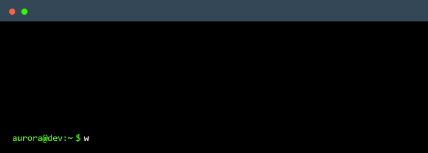

  

<h1 align="center">Aurora ✨</h1>

  Web Developer focused on building modern, scalable and accessible web experiences.

  
  

<h2 align="center">⚡ Dev Stack</h2>

  

<h2 align="center">🌐 Connect With Me</h2>

  

